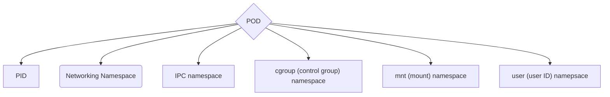

![[Control_plane_and_worker_nodes.png]]

### The Kubernetes API
All K8 API objects have:
- A names API version
- A kind
- A metadata section

View APIs:
`kubectl api-resources|head`

- `Namespaces` allow certain objects to exist inside of a specific namespace in simple form of hierarchical grouping. You can `delete` namspace to delete the app.

### The Pod
- One or more OCI images that run as containers on a K8 cluster node.
- `K8 node` is a single piece of computing power that runs a `kubelet`
![[pod.png]]
- `kubectl` provides a CLI interface to work with `K8 API server.`
- Pods are not used to install applications but [[Deployments]] and [[StatefulSets]] are used.
- When a Pod is started, you can view the Pod running in the default `Namespace` with `kubectl get po`
- A pod has 

#### API objects
- [[`Deployments`]] API objects that deploy.
- `Jobs` Run a Pod as batch process.
- `StatefulSets` Host applications that require specific needs and that are often stateful applications e.g. Databases
	- `Ordinal Pod` naming to get unique network identifiers
	- `Persisitent storage` that is always mounted to the same Pod.
	- `Ordered` starting, scaling, and updating.
- `DaemonSets` Used when a single Pod is to be run as an *agent* on every node of a cluster.
- Viewing the running Pod 
	`kubectl get po`

![[Pasted image 20230101174235.png]]
- Creating Namespace
	` kubectl create ns`